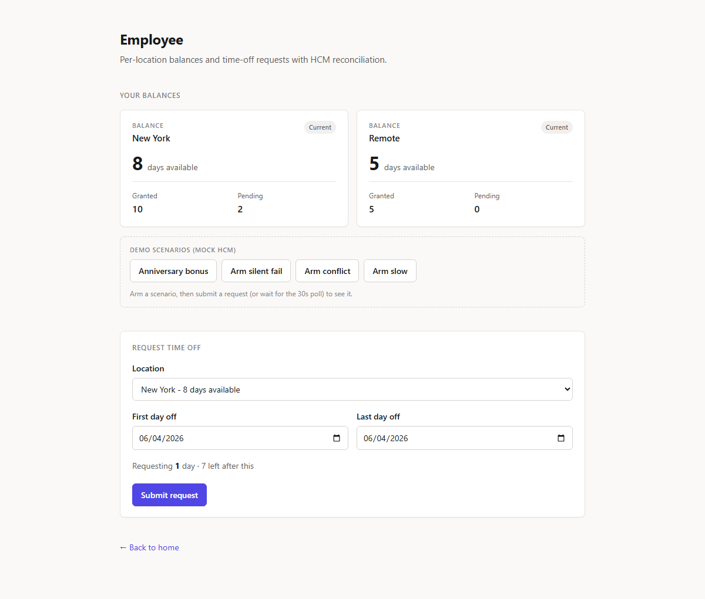
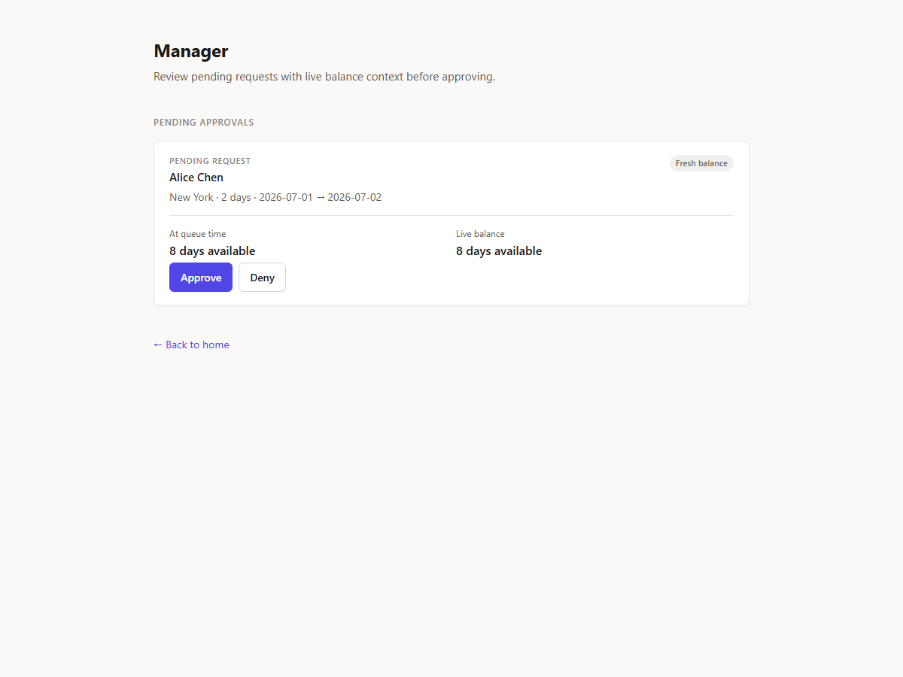
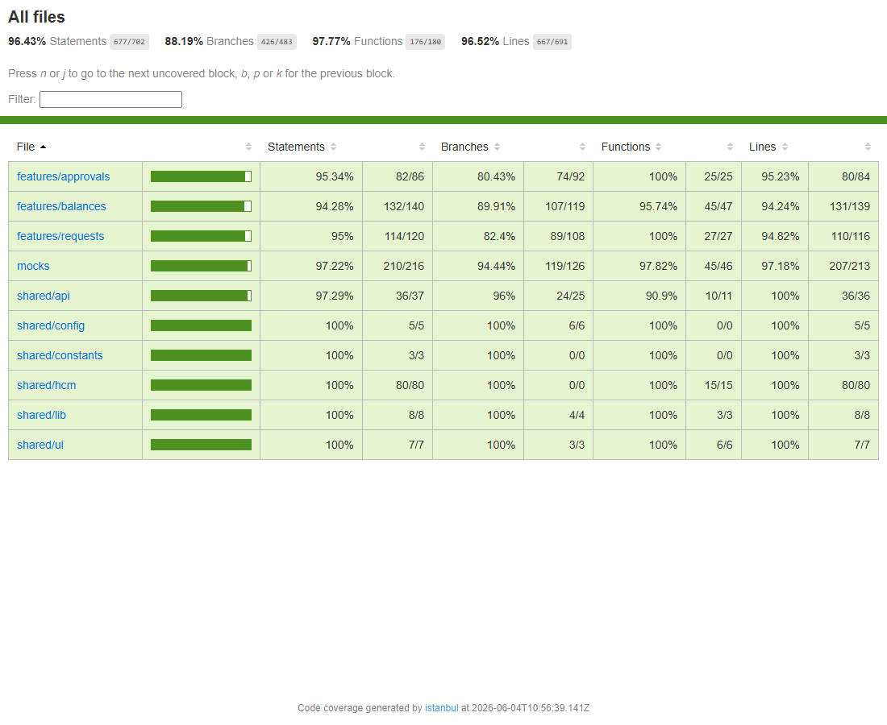

# ExampleHR — Time-Off Frontend

Employees view per-location leave balances and request time off; managers approve or deny — while an external **HCM** (Workday/SAP-style) stays the **source of truth**.

The hard part: make balances feel **instant** but stay **honest** when the real numbers live in a system you don't control and can change underneath you. The UI predicts optimistically, then **reconciles** against HCM and surfaces any contradiction — a rejection, a silent no-op, an anniversary bonus — instead of hiding it.



> **Tech:** Next.js 16 (App Router) · React 19 · TypeScript (strict) · TanStack Query v5 · Zod · MSW · Vitest · Playwright · Storybook 10.

## Quick start

Requires **Node 24.14.1** (`.nvmrc`). No env vars needed — the mock HCM is built in.

```bash
npm ci
npm run dev      # → http://localhost:3000
```

Open **`/employee`**, **`/manager`**, and **`/about`**. On the employee page, the *Demo scenarios* buttons trigger the interesting cases on demand (anniversary bonus, silent failure, conflict, slow HCM).

## How it works

```
Employee:  batch GET (hydrate) → per-cell GET polls every 30s (authoritative)
           submit → optimistic prediction → POST → reconcile on settle
              ↳ matches → success   ↳ HCM "no" → rejected   ↳ 200 but no change → "not applied"
Manager:   pending queue + live per-cell balance → approve/deny → invalidate + refetch
External:  a poll that sees a changed balance (anniversary) → "refreshed mid-session" banner
```

One client (`src/shared/api/client.ts`) → a mock HCM router (`src/mocks/router.ts`, shared by the Next route handler **and** MSW) → an in-memory store that behaves like a real, occasionally-misbehaving HCM. Full reasoning in **[docs/TRD.md](docs/TRD.md)**.



## Scripts

| Command | What |
|---------|------|
| `npm run dev` / `build` / `start` | Dev · production build · serve |
| `npm test` · `npm run test:coverage` | Vitest (unit + component + service + hook) · with coverage |
| `npm run test:e2e` | Playwright end-to-end (production build) |
| `npm run storybook` · `npm run test-storybook` | UI-state matrix · run story interaction tests headless |
| `npm run lint` · `npm run typecheck` | ESLint · `tsc --noEmit` (checks tests too) |

## Testing

Every layer the brief names is present and automated: **143 Vitest tests** (unit, component, service-contract via MSW, container-hook), **24 Storybook interaction tests**, and **3 Playwright e2e flows** (submit→approve, anniversary mid-session, silent-fail recovery). The failure modes — silent-fail, conflict, slow/timeout, duplicate booking, and the no-retry-on-non-idempotent-write rule — each have a dedicated regression test. Coverage ≈ **96% lines / 88% branch** (the residual is defensive guards and timing-transient UI states). What each layer guards and why: **[docs/TESTING.md](docs/TESTING.md)**.



> Regenerate any time with `npm run test:coverage` (full HTML report in `coverage/`).

## CI & deploy

- **CI** (`.github/workflows/ci.yml`): on every push/PR — lint, typecheck, coverage, build, `npm audit` (high blocks), e2e, Storybook.
- **App → Vercel:** import the repo at [vercel.com/new](https://vercel.com/new) → **Deploy**. It's server-rendered Next.js, so no env vars and no rewrite config are needed; nested routes reload fine. *(The in-memory mock may reset state on Vercel's serverless cold starts — it's fully consistent locally.)*
- **Storybook → GitHub Pages:** `.github/workflows/deploy-storybook.yml` builds and publishes the static Storybook on every push. One-time: repo **Settings → Pages → Source = "GitHub Actions"**, then it's live at `https://<owner>.github.io/<repo>/` — drop the link here once it's up.

## Docs

[TRD](docs/TRD.md) (architecture, reconciliation, alternatives) · [Testing](docs/TESTING.md) · [Build phases](PHASES.md) · [Cursor rules](.cursorrules)
