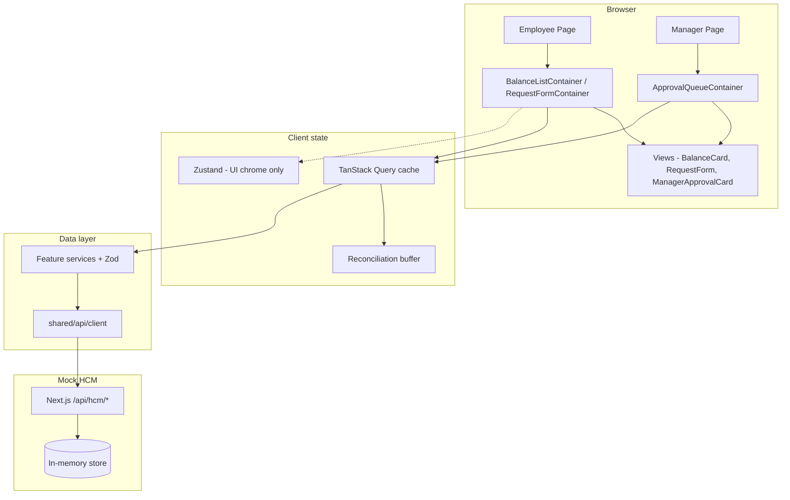
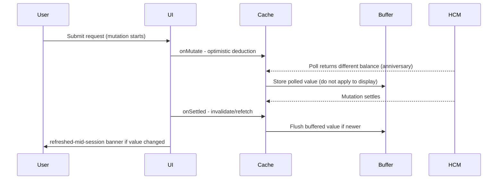

# Technical Requirements Document (TRD)
# ExampleHR Time-Off Module

| Field | Value |
|-------|-------|
| Version | 1.0 |
| Status | Approved for implementation |
| Stack | Next.js 16 (App Router), React 19, TypeScript strict, TanStack Query v5, Zustand, Zod |
| Runtime | Node.js 24.14.1 |
| Source of truth | External HCM (mocked locally) |

This document is self-contained. Implementation must follow this TRD and `.cursorrules`.

---

## 1. Problem statement

ExampleHR provides the primary UI for employees to request time off. Employment balances and request records are owned by an external **Human Capital Management (HCM)** system (e.g. Workday, SAP). ExampleHR does not control those numbers.

### Tension

- **Employees** expect instant feedback when viewing balances and submitting requests.
- **HCM** may reject requests, respond slowly, return HTTP success without persisting changes (*silent failure*), or change balances in the background (e.g. work-anniversary bonus while the app is open).

The frontend must feel responsive while **never lying** about approval state or final balances.

### Personas

| Persona | Need | Failure we must avoid |
|---------|------|------------------------|
| **Employee** | Accurate per-location balance; instant submit feedback | Shown "approved" then later "denied" |
| **Manager** | Approve/deny with balance valid **at decision time** | Acting on a balance that was true minutes ago |

---

## 2. Constraints

| Constraint | Implication |
|------------|-------------|
| Balances are **per employee, per location** | Multiple cards/rows per employee; queries keyed by `(employeeId, locationId)` |
| HCM exposes **batch** balance API | Expensive; used once for initial hydration + periodic reconciliation |
| HCM exposes **per-cell** read/write API | Authoritative for that cell; polled on an interval |
| HCM errors are usually explicit | Map to `hcm-rejected` with clear messaging |
| HCM can **silently fail** | HTTP 200 on write but GET unchanged → detect only via post-mutation reconciliation |
| ExampleHR is not the only HCM writer | Background balance changes must not surprise the user |
| No real HCM in scope | Mock Next.js route handlers + MSW mirror the same contract |

---

## 3. Architecture

### 3.1 Layering

```
Page (thin)
 └── FeatureContainer     # useQuery, useMutation, orchestration, status derivation
      └── FeatureView     # typed props only; local UI state (dropdown open, etc.)
```

- **Pages** (`src/app/`) compose containers and pass route params only. No `useQuery`, no services.
- **Features** (`balances`, `requests`, `approvals`) do not import each other. Shared code lives in `src/shared/`.
- **Mocks** (`src/mocks/`) are first-class: fixtures, scenarios, MSW handlers, shared in-memory store for API routes.

### 3.2 Diagram



---

## 4. State management

### 4.1 Decision

| Concern | Tool | Rule |
|---------|------|------|
| Server / remote data | **TanStack Query v5** | All balances, requests, approvals; polling; mutations; cache |
| UI chrome | **Zustand** (+ immer, devtools in dev) | Modals, tabs, panel open — **never** balances or request payloads |
| Derived values | **useMemo** | e.g. `availableBalance = confirmed - pending` |

### 4.2 Alternatives considered

| Alternative | Verdict | Reason |
|-------------|---------|--------|
| **Pessimistic-only UI** (wait for server before any UI change) | Rejected | Correct but feels broken for submit; poor employee UX |
| **Redux / global store for balances** | Rejected | Duplicates HCM; reconciliation and polling become error-prone |
| **SWR** | Rejected | We need mutation lifecycle hooks (`onMutate` / `onSettled`) as a first-class contract |
| **Copy server data into Zustand** | Rejected | Two sources of truth; optimistic rollback harder |

---

## 5. Optimistic update strategy

### 5.1 Contract (every balance/request mutation)

1. **`onMutate`**: `cancelQueries` for rollback key → snapshot cache → `setQueryData` with predicted value.
2. **`onError`**: restore snapshot from context.
3. **`onSuccess`**: invalidate or surgical update (do not assume HCM body is correct).
4. **`onSettled`**: **mandatory** `invalidateQueries` — reconciliation against HCM.

Never show a **permanent** approved/denied state until `onSettled` completes and cache reflects refetched data.

If refetch contradicts the prediction → surface **`hcm-silent-conflict`** (non-blocking notice), not a silent overwrite.

### 5.2 Alternatives considered

| Alternative | Verdict | Reason |
|-------------|---------|--------|
| Optimistic without rollback | Rejected | Leaves wrong numbers on failure |
| Skip `onSettled` invalidation | Rejected | Cannot detect silent failure or anniversary drift |
| Pessimistic submit only | Rejected | Assignment requires instant feedback |

---

## 6. Cache and invalidation

### 6.1 Query keys (hierarchical, never inlined)

- `BALANCE_KEYS.all` → `byEmployee(id)` → `byEmployeeAndLocation(id, locationId)`
- `REQUEST_KEYS` — same pattern for requests feature
- `APPROVAL_KEYS` — same pattern for approvals feature

Invalidate the **broadest correct scope** after mutations (e.g. employee-level balance key after submit affecting one location).

### 6.2 Hydration and polling

| Mechanism | When | Constant |
|-----------|------|----------|
| Batch GET | Once on initial load (employee screen) | — |
| Per-cell GET | Poll while view mounted | `BALANCE_POLL_INTERVAL_MS` = 30_000 |
| Background poll | Paused when tab unfocused | `refetchIntervalInBackground: false` |
| `staleTime` | Set explicitly per query | Named constants only |

---

## 7. Reconciliation buffer (critical)

### 7.1 Problem

A background poll may return a new balance **while** an optimistic mutation is in flight. Applying the poll immediately would overwrite the user's predicted value and confuse them.

### 7.2 Sequence



### 7.3 Numbered rules for implementers

1. If `mutation.isPending` and per-cell poll returns `value !== displayedOptimistic` → write poll result to **buffer**, not display cache.
2. On mutation **`onSettled`** → refetch/invalidate → compare server value to optimistic prediction.
3. Flush buffer into cache after settle; if buffer differed from pre-mutation baseline → set status **`refreshed-mid-session`** (inline banner).
4. If server success but balance unchanged vs prediction → **`hcm-silent-conflict`** / `SILENT_FAILURE`.

---

## 8. Display status model

```typescript
type BalanceDisplayStatus =
  | "idle"
  | "loading"
  | "stale"
  | "optimistic-pending"
  | "optimistic-rolled-back"
  | "hcm-rejected"
  | "hcm-silent-conflict"
  | "refreshed-mid-session"
  | "error"
  | "success";
```

| Status | When |
|--------|------|
| `idle` | No fetch yet |
| `loading` | Initial fetch, no cached data |
| `stale` | Cached data, query stale or refetching in background |
| `optimistic-pending` | Mutation in flight; showing predicted balance |
| `optimistic-rolled-back` | Mutation failed; cache restored; distinct from generic error |
| `hcm-rejected` | Explicit HCM denial (`INSUFFICIENT_BALANCE`, `INVALID_DIMENSION`) |
| `hcm-silent-conflict` | HTTP success but reconciliation shows no change / mismatch |
| `refreshed-mid-session` | Post-settle flush shows HCM changed balance externally |
| `error` | Network, timeout, unknown |
| `success` | Query succeeded, no special reconciliation flags |

`optimistic-rolled-back` must be visually distinct from `error` — data is ground truth again; the action did not land.

---

## 9. API contract (mock HCM)

Base path: `/api/hcm` (Next.js route handlers). MSW mirrors the same paths for Storybook/Vitest.

| Method | Path | Purpose |
|--------|------|---------|
| GET | `/balances/batch` | Full corpus — hydration |
| GET | `/balances/:employeeId/:locationId` | Authoritative cell read |
| POST | `/balances/:employeeId/:locationId` | Cell write |
| POST | `/requests` | Create time-off request |
| PATCH | `/requests/:requestId` | Update status (approve/deny) |
| POST | `/simulate/anniversary` | Trigger bonus for employee |
| POST | `/simulate/silent-fail` | Arm next write: 200 but no persist |
| POST | `/simulate/conflict` | Arm next write: 409 |
| POST | `/simulate/slow` | Arm next request: 6–12s delay |

### 9.1 Error model (`HCMError`)

| Code | `retryable` | Typical UI |
|------|-------------|------------|
| `INSUFFICIENT_BALANCE` | false | `hcm-rejected` |
| `INVALID_DIMENSION` | false | `hcm-rejected` |
| `CONFLICT` | false | Error / conflict on approve |
| `SILENT_FAILURE` | false | `hcm-silent-conflict` (client-detected after settle) |
| `TIMEOUT` | true | `error` |
| `NETWORK` | true | `error` |
| `UNKNOWN` | false | `error` |

All HTTP errors return sanitized JSON envelope — no stack traces to client.

---

## 10. Component tree map

### 10.1 Employee route `/(employee)`

| Container | Queries / mutations | Child view |
|-----------|---------------------|------------|
| `BalanceListContainer` | `useBalanceBatchHydration`, per-cell `useBalanceQuery` + reconciliation hook | `BalanceListView` → `BalanceCard[]` |
| `RequestFormContainer` | `useOptimisticRequest` (submit mutation) | `RequestForm` |

Page: composes both containers; passes `employeeId` from session/mock auth only (not URL query params).

### 10.2 Manager route `/(manager)`

| Container | Queries / mutations | Child view |
|-----------|---------------------|------------|
| `ApprovalQueueContainer` | `usePendingApprovals`, `useApproveRequest`, `useDenyRequest`, fresh balance reads per request | `ApprovalQueueView` → `ManagerApprovalCard[]` |

Each approval card receives balance status at decision time (`PendingWithFreshBalance` vs `PendingWithStaleBalance`).

---

## 11. Mock HCM behavior matrix

| Scenario | Trigger | Expected behavior |
|----------|---------|-------------------|
| Happy path write | POST request | Balance decreases; GET confirms |
| Insufficient balance | POST over available | 4xx + `INSUFFICIENT_BALANCE` |
| Invalid dimension | Bad employee/location pair | 4xx + `INVALID_DIMENSION` |
| Anniversary | POST `/simulate/anniversary` | Server increments balance; next poll → `refreshed-mid-session` |
| Silent fail | POST `/simulate/silent-fail` then write | Write 200; GET unchanged → client `SILENT_FAILURE` on settle |
| Conflict | POST `/simulate/conflict` then write | 409 `CONFLICT` |
| Slow | POST `/simulate/slow` | 6–12s delay; loading states |
| Concurrent poll + mutation | Anniversary during submit | Buffer holds poll until settle |

Seed data: fixed `employeeId` / `locationId` values in `src/mocks/fixtures/`.

---

## 12. Test strategy

| Layer | Tool | Guards | Regression rationale |
|-------|------|--------|------------------------|
| Pure utils | Vitest | `applyOptimisticDeduction`, reconciliation, silent-fail detection | Math bugs are silent and cheap to test |
| Services | Vitest + MSW | Zod strict parsing, every `HCMErrorCode` mapping | Contract drift breaks all features |
| Container hooks | Vitest + RTL | Optimistic rollback, `onSettled` invalidation, buffer flush | Highest business-logic density |
| UI states | Storybook `play` | All `BalanceDisplayStatus` + form/approval states | PM-visible; catches missing states |
| E2E | Playwright | Submit→approve; anniversary mid-session; **silent fail recovery** | Only layer proving full pipeline |

**Dedicated silent-failure integration test** — required. It is the failure mode most likely to regress without failing builds.

Tests reset MSW handlers and Query cache per test. Line coverage is a floor; **behavioral matrix coverage** is the goal.

---

## 13. Security summary

| Area | Requirement |
|------|-------------|
| Config | `shared/config/config.ts` only reads `process.env`; fail at startup if invalid |
| Route handlers | Mock auth check first; Zod body validation → 400; rate limit mutations |
| Client | No tokens in `localStorage`; no employee ID or balance in URL query params |
| Logging | No PII/balances in production console |
| Dependencies | Pinned versions in `package.json`; `npm audit` in CI |
| CORS | Explicit origins in staging/production (mock dev: permissive localhost) |

---

## 14. Out of scope

- Real Workday/SAP integration
- Production identity provider (mock auth gate sufficient)
- i18n / localization
- Native mobile apps
- Manager hierarchy / delegation rules beyond pending queue

---

## 15. Technology choices (Phase 1 baseline)

| Choice | Version policy | Note |
|--------|----------------|------|
| Next.js | 16.2.x stable | Turbopack default; App Router; async route APIs |
| React | 19.2.x | Matches Next 16 |
| Node | 24.14.1 | Pinned in `.nvmrc` / `engines` |
| Storybook | 10.4.x with `@storybook/nextjs` | MSW addon for async stories |

---

## Appendix A — Reference documents

- `.cursorrules` — implementation law (mutation contract, folder structure, Storybook list)
- `PHASES.md` — build order and phase acceptance criteria
