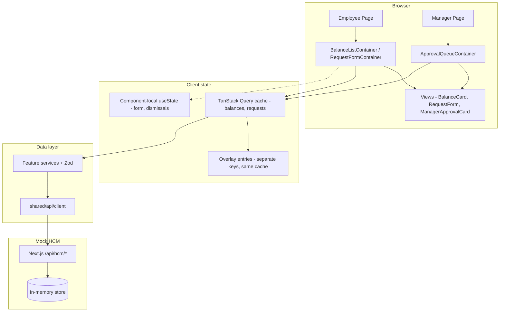
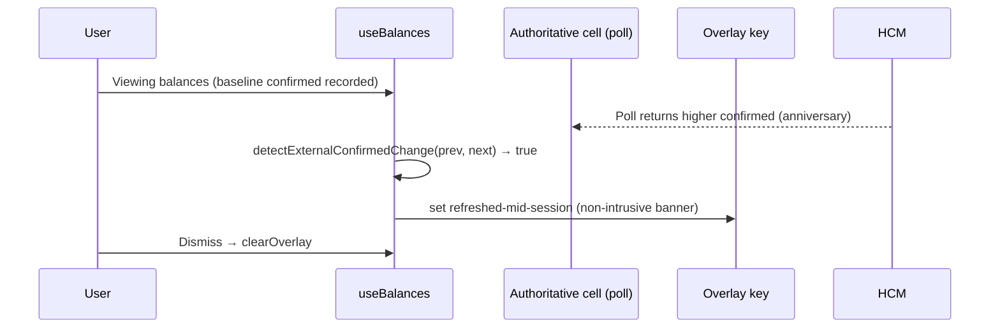

# Technical Requirements Document (TRD)
# ExampleHR Time-Off Module

| Field | Value |
|-------|-------|
| Version | 1.0 |
| Status | Approved for implementation |
| Stack | Next.js 16 (App Router), React 19, TypeScript strict, TanStack Query v5, Zod |
| Runtime | Node.js 24.14.1 |
| Source of truth | External HCM (mocked locally) |

This document is self-contained. Implementation must follow this TRD and `.cursorrules`.

---

## 1. Problem statement

ExampleHR provides the primary UI for employees to request time off. Employment balances and request records are owned by an external **Human Capital Management (HCM)** system (e.g. Workday, SAP). ExampleHR does not control those numbers.

### Tension

- **Employees** expect instant feedback when viewing balances and submitting requests.
- **HCM** may reject requests, respond slowly, return HTTP success without persisting changes (*silent failure*), or change balances in the background (e.g. work-anniversary bonus while the app is open).

The frontend must feel responsive while **never lying** about approval state or final balances.

### Personas

| Persona | Need | Failure we must avoid |
|---------|------|------------------------|
| **Employee** | Accurate per-location balance; instant submit feedback | Shown "approved" then later "denied" |
| **Manager** | Approve/deny with balance valid **at decision time** | Acting on a balance that was true minutes ago |

---

## 2. Constraints

| Constraint | Implication |
|------------|-------------|
| Balances are **per employee, per location** | Multiple cards/rows per employee; queries keyed by `(employeeId, locationId)` |
| HCM exposes **batch** balance API | Expensive; used once for initial hydration + periodic reconciliation |
| HCM exposes **per-cell** read/write API | Authoritative for that cell; polled on an interval |
| HCM errors are usually explicit | Map to `hcm-rejected` with clear messaging |
| HCM can **silently fail** | HTTP 200 on write but GET unchanged → detect only via post-mutation reconciliation |
| ExampleHR is not the only HCM writer | Background balance changes must not surprise the user |
| No real HCM in scope | Mock Next.js route handlers + MSW mirror the same contract |

---

## 3. Architecture

### 3.1 Layering

```
Page (thin)
 └── FeatureContainer     # useQuery, useMutation, orchestration, status derivation
      └── FeatureView     # typed props only; local UI state (dropdown open, etc.)
```

- **Pages** (`src/app/`) compose containers and pass route params only. No `useQuery`, no services.
- **Features** (`balances`, `requests`, `approvals`) do not import each other. Shared code lives in `src/shared/`.
- **Mocks** (`src/mocks/`) are first-class: seed data, scenarios, MSW handlers, shared in-memory store for API routes.

### 3.2 Diagram



---

## 4. State management

### 4.1 Decision

| Concern | Tool | Rule |
|---------|------|------|
| Server / remote data | **TanStack Query v5** | All balances, requests, approvals; polling; mutations; cache |
| Client UI state | **Component-local `useState`** | Form fields, selected location, dismissable banners — never server data |
| Derived values | **useMemo** | e.g. `availableBalance = confirmed - pending` |

> **On a global UI-state store (Zustand/Redux):** evaluated and **deliberately not adopted.** No genuine cross-component UI state arose — form inputs are local, and the per-cell reconciliation banners ("rolled back", "silent conflict", "refreshed") live as **entries in the Query cache** keyed per cell (so balance invalidation and dismissal flow through the same system that owns the data). If we later added a global confirm-modal, a multi-panel layout, or cross-route UI flags, Zustand (UI state only, **never** server data) would be the choice. Adding it now would be ceremony with nothing to hold.

### 4.2 Alternatives considered

| Alternative | Verdict | Reason |
|-------------|---------|--------|
| **Pessimistic-only UI** (wait for server before any UI change) | Rejected | Correct but feels broken for submit; poor employee UX |
| **Redux / global store for balances** | Rejected | Duplicates HCM; reconciliation and polling become error-prone |
| **SWR** | Rejected | We need mutation lifecycle hooks (`onMutate` / `onSettled`) as a first-class contract |
| **Zustand for UI chrome** | Deferred | No cross-component UI state arose; component-local state sufficed. Reach for it only when shared UI state actually appears — never for server data |

---

## 5. Optimistic update strategy

### 5.1 Contract (every balance/request mutation)

1. **`onMutate`**: `cancelQueries` for rollback key → snapshot cache → `setQueryData` with predicted value.
2. **`onError`**: restore snapshot from context.
3. **`onSuccess`**: invalidate or surgical update (do not assume HCM body is correct).
4. **`onSettled`**: **mandatory** `invalidateQueries` — reconciliation against HCM.

Never show a **permanent** approved/denied state until `onSettled` completes and cache reflects refetched data.

If refetch contradicts the prediction → surface **`hcm-silent-conflict`** (non-blocking notice), not a silent overwrite.

**Mutations are never auto-retried.** The writes are non-idempotent — a `POST`/`PATCH` that times out may have already succeeded server-side, so an automatic retry would *duplicate* it. Failed writes surface to the user (rolled-back, with the cause); a manual retry is safe because they see the reconciled state first. (Reads/queries still retry on retryable errors — they're idempotent.)

### 5.2 Alternatives considered

| Alternative | Verdict | Reason |
|-------------|---------|--------|
| Optimistic without rollback | Rejected | Leaves wrong numbers on failure |
| Skip `onSettled` invalidation | Rejected | Cannot detect silent failure or anniversary drift |
| Pessimistic submit only | Rejected | Assignment requires instant feedback |

---

## 6. Cache and invalidation

### 6.1 Query keys (hierarchical, never inlined)

- `BALANCE_KEYS.all` → `byEmployee(id)` → `byEmployeeAndLocation(id, locationId)`
- `REQUEST_KEYS` — same pattern for requests feature
- `APPROVAL_KEYS` — same pattern for approvals feature

Invalidate the **broadest correct scope** after mutations (e.g. employee-level balance key after submit affecting one location).

### 6.2 Hydration and polling

| Mechanism | When | Constant |
|-----------|------|----------|
| Batch GET | Once on initial load (employee screen) | — |
| Per-cell GET | Poll while view mounted | `BALANCE_POLL_INTERVAL_MS` = 30_000 |
| Background poll | Paused when tab unfocused | `refetchIntervalInBackground: false` |
| `staleTime` | Set explicitly per query | Named constants only |

---

## 7. Reconciling a background poll with an in-flight action (critical)

### 7.1 Problem

A background poll may return a new balance **while** an optimistic mutation is in flight. The naive fix is a literal *buffer*: stash the polled value, hold it back from the display, and flush it after the mutation settles.

We rejected the literal buffer (see 7.4) because it requires the optimistic value and the authoritative value to share one cache slot — and a poll that lands on that slot overwrites the optimistic prediction before any buffer can intercept it. The same flaw makes "polled vs displayed" a comparison of a value against itself.

### 7.2 Chosen model — authoritative truth + composable optimistic overlay

The per-cell poll is **always written straight into its own cache key and is always treated as truth.** The optimistic deduction is **never written into that cache** — it is *derived* at display time and layered on top:

```
displayedPending   = authoritativeCell.pendingDeductions + Σ(days of pending submits for this cell)
displayedAvailable = max(0, authoritativeCell.confirmedBalance - displayedPending)
```

Because the deduction is a derivation rather than a stored value, **a poll can never clobber it** — refreshing `confirmedBalance` and adding the optimistic `pending` overlay simply compose. This removes the buffer, the refs, and the dual-key bookkeeping entirely.

### 7.3 Detecting an external refresh (the `refreshed-mid-session` signal)

This view never mutates `confirmedBalance` itself (a submit only changes pending deductions; approvals live in the manager view). Therefore **any change to `confirmedBalance` reported by a poll is external** — an HCM-side refresh such as an anniversary bonus.



Rules for implementers:

1. Per cell, keep the **last observed `confirmedBalance`** (a ref). On the first observation, record the baseline only — never banner.
2. When a poll reports a `confirmedBalance` that differs from the last observed value → set the **`refreshed-mid-session`** overlay (skip if an overlay is already showing, so a silent-conflict warning is not overwritten).
3. Optimistic deductions are derived from pending mutations, so this detection works identically whether or not a submit is in flight.
4. **Silent failure** is detected on `onSettled`: snapshot the cell in `onMutate` (read-only, no write), then after `invalidateQueries` refetches the authoritative cell, compare `refetched.pendingDeductions` to `snapshot.pendingDeductions + days`. A mismatch → **`hcm-silent-conflict`** / `SILENT_FAILURE`.

### 7.4 Alternative considered — literal poll buffer

| Alternative | Verdict | Reason |
|-------------|---------|--------|
| Literal buffer (stash poll, flush after settle) | **Rejected** | Optimistic + authoritative values must share one cache key, so an in-flight poll overwrites the prediction before the buffer can hold it; "polled vs displayed" degenerates to comparing a value to itself. Composable overlay is simpler and cannot clobber. |
| Separate `…/authoritative` + `…/display` keys | Rejected | Removes the clobber but duplicates every cell and adds a manual sync step; derivation achieves the same with no second key. |
| Suspend polling while a mutation is pending | Rejected | Hides genuine external changes (anniversary) during exactly the window we most want to surface them. |

---

## 8. Display status model

```typescript
type BalanceDisplayStatus =
  | "idle"
  | "loading"
  | "stale"
  | "optimistic-pending"
  | "optimistic-rolled-back"
  | "hcm-rejected"
  | "hcm-silent-conflict"
  | "refreshed-mid-session"
  | "error"
  | "success";
```

| Status | When |
|--------|------|
| `idle` | No fetch yet |
| `loading` | Initial fetch, no cached data |
| `stale` | Cached data, query stale or refetching in background |
| `optimistic-pending` | Mutation in flight; showing predicted balance |
| `optimistic-rolled-back` | Mutation failed; cache restored; distinct from generic error |
| `hcm-rejected` | Explicit HCM denial (`INSUFFICIENT_BALANCE`, `INVALID_DIMENSION`) |
| `hcm-silent-conflict` | HTTP success but reconciliation shows no change / mismatch |
| `refreshed-mid-session` | Post-settle flush shows HCM changed balance externally |
| `error` | Network, timeout, unknown |
| `success` | Query succeeded, no special reconciliation flags |

`optimistic-rolled-back` must be visually distinct from `error` — data is ground truth again; the action did not land.

---

## 9. API contract (mock HCM)

Base path: `/api/hcm` (Next.js route handlers). MSW mirrors the same paths for Storybook/Vitest.

| Method | Path | Purpose |
|--------|------|---------|
| GET | `/balances/batch` | Full corpus — hydration |
| GET | `/balances/:employeeId/:locationId` | Authoritative cell read |
| POST | `/balances/:employeeId/:locationId` | Cell write |
| POST | `/requests` | Create time-off request |
| PATCH | `/requests/:requestId` | Update status (approve/deny) |
| POST | `/simulate/anniversary` | Trigger bonus for employee |
| POST | `/simulate/silent-fail` | Arm next write: 200 but no persist |
| POST | `/simulate/conflict` | Arm next write: 409 |
| POST | `/simulate/slow` | Arm next request: 6–12s delay |

### 9.1 Error model (`HCMError`)

| Code | `retryable` | Typical UI |
|------|-------------|------------|
| `INSUFFICIENT_BALANCE` | false | `hcm-rejected` |
| `INVALID_DIMENSION` | false | `hcm-rejected` |
| `CONFLICT` | false | Error / conflict on approve |
| `SILENT_FAILURE` | false | `hcm-silent-conflict` (client-detected after settle) |
| `TIMEOUT` | true | `error` |
| `NETWORK` | true | `error` |
| `UNKNOWN` | false | `error` |

All HTTP errors return sanitized JSON envelope — no stack traces to client.

---

## 10. Component tree map

### 10.1 Employee route `/(employee)`

| Container | Queries / mutations | Child view |
|-----------|---------------------|------------|
| `EmployeeBalancesContainer` | `useBalances` — batch hydration + per-cell polls, optimistic-overlay derivation, external-change detection | `EmployeeBalancesView` → `BalanceCard[]` |
| `RequestForm` container | `useSubmitRequest` — submit mutation (snapshot + `onSettled` reconciliation) | `RequestForm` view |

Page: composes both containers; passes `employeeId` from session/mock auth only (not URL query params). Container + view + card are colocated per feature file (see `.cursorrules` §2) rather than split across folders.

### 10.2 Manager route `/(manager)`

| Container | Queries / mutations | Child view |
|-----------|---------------------|------------|
| `ApprovalQueueContainer` | `usePendingApprovals`, `useApproveRequest`, `useDenyRequest`, fresh balance reads per request | `ApprovalQueueView` → `ManagerApprovalCard[]` |

Each approval card receives balance status at decision time (`PendingWithFreshBalance` vs `PendingWithStaleBalance`).

---

## 11. Mock HCM behavior matrix

| Scenario | Trigger | Expected behavior |
|----------|---------|-------------------|
| Happy path write | POST request | Balance decreases; GET confirms |
| Insufficient balance | POST over available | 4xx + `INSUFFICIENT_BALANCE` |
| Invalid dimension | Bad employee/location pair | 4xx + `INVALID_DIMENSION` |
| Anniversary | POST `/simulate/anniversary` | Server increments balance; next poll → `refreshed-mid-session` |
| Silent fail | POST `/simulate/silent-fail` then write | Write 200; GET unchanged → client `SILENT_FAILURE` on settle |
| Conflict | POST `/simulate/conflict` then write | 409 `CONFLICT` |
| Slow | POST `/simulate/slow` | 6–12s delay; loading states |
| Concurrent poll + mutation | Anniversary during submit | Poll writes truth; the optimistic deduction is derived on top, so they compose without clobbering (see §7.2) |

Seed data: fixed `employeeId` / `locationId` values in `src/mocks/seed.ts`.

---

## 12. Test strategy

| Layer | Tool | Guards | Regression rationale |
|-------|------|--------|------------------------|
| Pure utils | Vitest | `applyOptimisticDeduction`, reconciliation, silent-fail detection | Math bugs are silent and cheap to test |
| Services | Vitest + MSW | Zod strict parsing, every `HCMErrorCode` mapping | Contract drift breaks all features |
| Container hooks | Vitest + RTL | Optimistic rollback, `onSettled` invalidation, overlay composition | Highest business-logic density |
| UI states | Storybook `play` | All `BalanceDisplayStatus` + form/approval states | PM-visible; catches missing states |
| E2E | Playwright | Submit→approve; anniversary mid-session; **silent fail recovery** | Only layer proving full pipeline |

**Dedicated silent-failure integration test** — required. It is the failure mode most likely to regress without failing builds.

Tests reset MSW handlers and Query cache per test. Line coverage is a floor; **behavioral matrix coverage** is the goal.

---

## 13. Security summary

| Area | Requirement |
|------|-------------|
| Config | `shared/config/config.ts` only reads `process.env`; Zod-validates shape, defaults when unset (so CI/Vercel prerender builds), rejects malformed values |
| Route handlers | Mock auth check first; Zod body validation → 400; **fixed-window rate limit on mutations** (POST/PATCH) → 429 |
| Client | No tokens in `localStorage`; no employee ID or balance in URL query params |
| Logging | No PII/balances in production console |
| Dependencies | Pinned versions in `package.json`; `npm audit` in CI |
| CORS | **Explicit origin allowlist** (dev app + Storybook); preflight (`OPTIONS`) handled; **no wildcard** — disallowed origins get no CORS headers |

---

## 14. Assumptions & deliberate decisions

These are conscious scope choices, not oversights. Two of them follow directly from the
core principle that **HCM owns the numbers** — the frontend doesn't reimplement policy the
source of truth would compute.

- **Days = inclusive calendar days, not business days.** Working-day and holiday calendars
  are per-location policy the HCM owns; the frontend deliberately doesn't reinvent (and risk
  getting wrong) what the source of truth computes.
- **Same-day leave can co-exist across different locations.** Per-location balances are
  independent, so overlap is rejected only *within* a location. "Can one person be absent
  across two locations on the same day?" is an aggregate rule the HCM would own.
- **No past-dated requests.** Blocked for demo clarity. A real system might allow a
  back-dating window (sudden/sick leave) — a product decision, intentionally out of scope.

### Out of scope

Real Workday/SAP integration · production identity provider (mock auth gate suffices) ·
i18n · native mobile · manager hierarchy/delegation beyond the pending queue · a persistent
backing store (the mock HCM is in-memory).

---

## 15. Technology choices (Phase 1 baseline)

| Choice | Version policy | Note |
|--------|----------------|------|
| Next.js | 16.2.x stable | Turbopack default; App Router; async route APIs |
| React | 19.2.x | Matches Next 16 |
| Node | 24.14.1 | Pinned in `.nvmrc` / `engines` |
| Storybook | 10.4.x with `@storybook/nextjs` | MSW addon for async stories |

---

## Appendix A — Reference documents

- `.cursorrules` — implementation law (mutation contract, folder structure, Storybook list)
- `PHASES.md` — build order and phase acceptance criteria
